# Diagramas UML — SecOps Hub

Colección de diagramas UML en notación **Mermaid**, renderizables en GitHub, GitLab, VS Code y Cursor.

---

## 1. Diagrama de casos de uso

Representa las interacciones entre actores y el sistema.

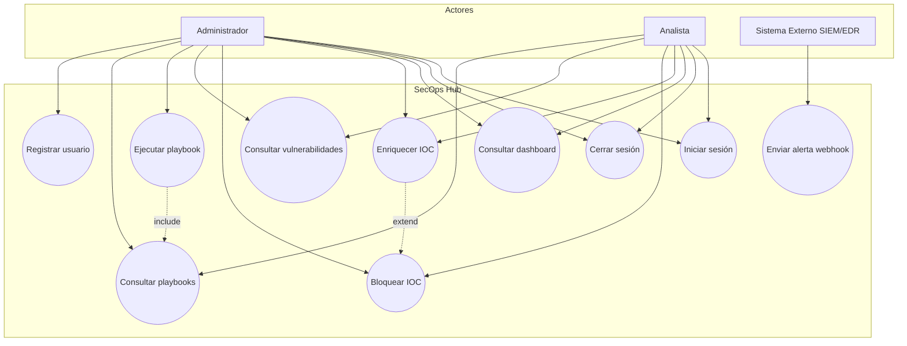

**Leyenda:**
- **Include:** Ejecutar playbook incluye consultar catálogo
- **Extend:** Bloquear IOC extiende enriquecimiento (opcional tras análisis)

---

## 2. Diagrama de clases (dominio)

Modelo de datos y relaciones principales del dominio.

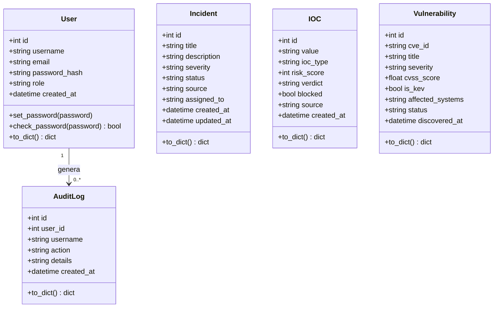

**Archivo fuente:** `backend/app/models/__init__.py`

---

## 3. Diagrama de clases (capa de servicios)

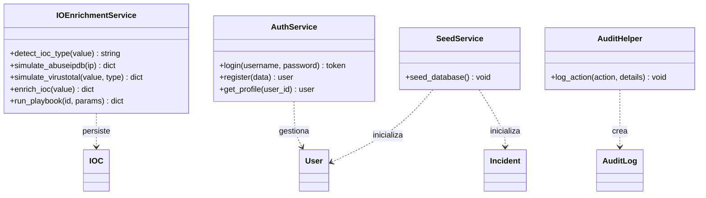

**Archivos:** `services/ioc_enrichment.py`, `services/seed.py`, `routes/auth.py`, `utils/helpers.py`

---

## 4. Diagrama de secuencia — Login (CU-01)

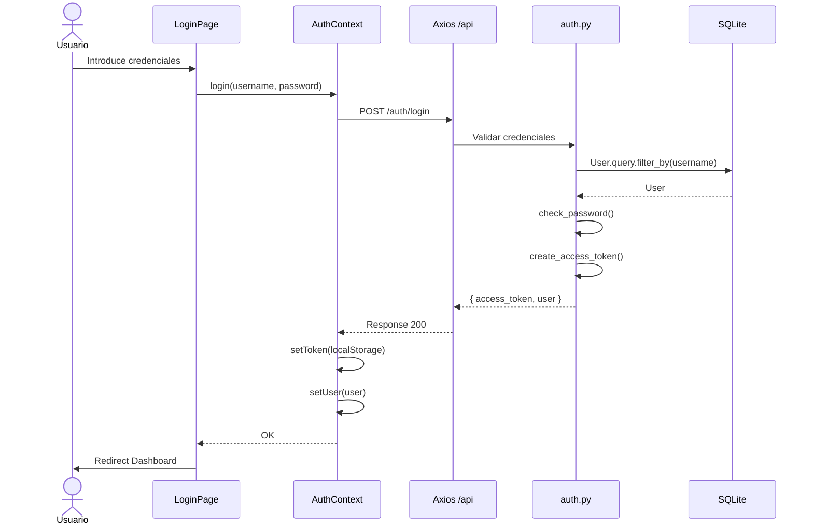

---

## 5. Diagrama de secuencia — Enriquecimiento IOC (CU-04)

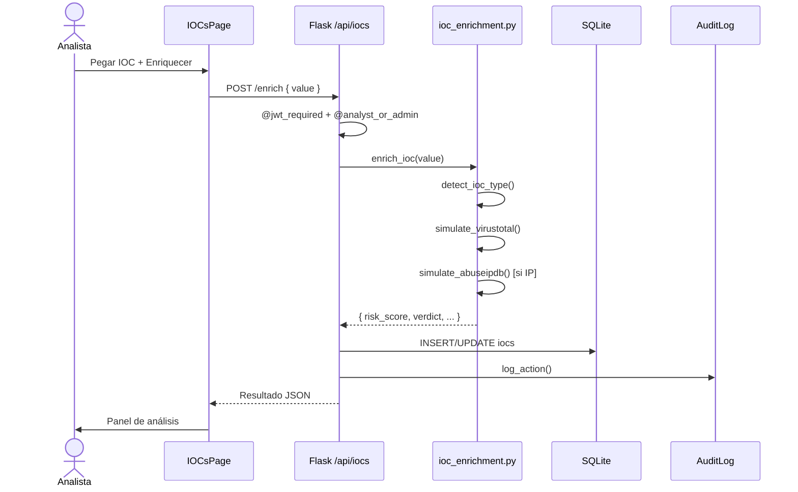

---

## 6. Diagrama de secuencia — Webhook de alerta (CU-08)

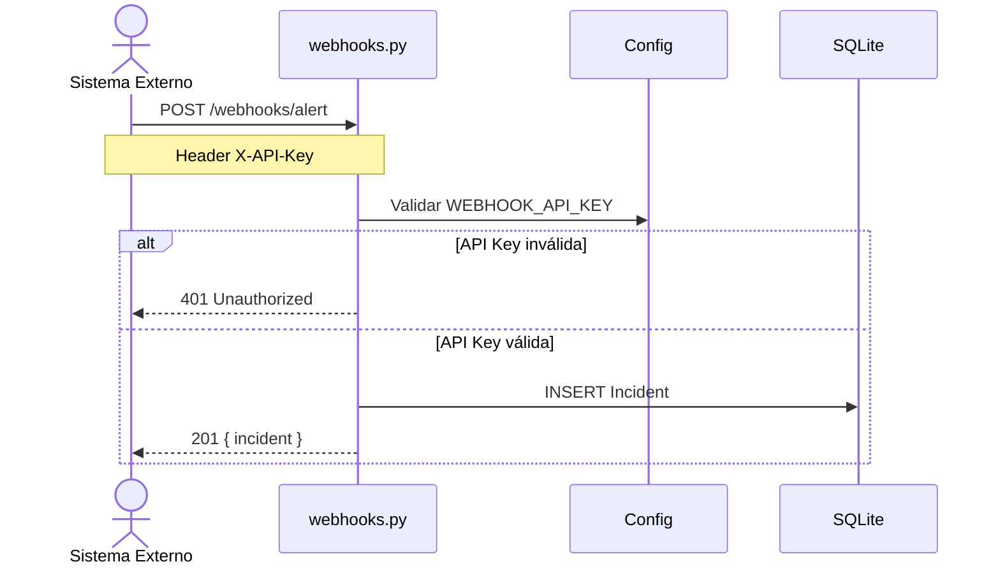

---

## 7. Diagrama de secuencia — Ejecutar playbook (CU-07)

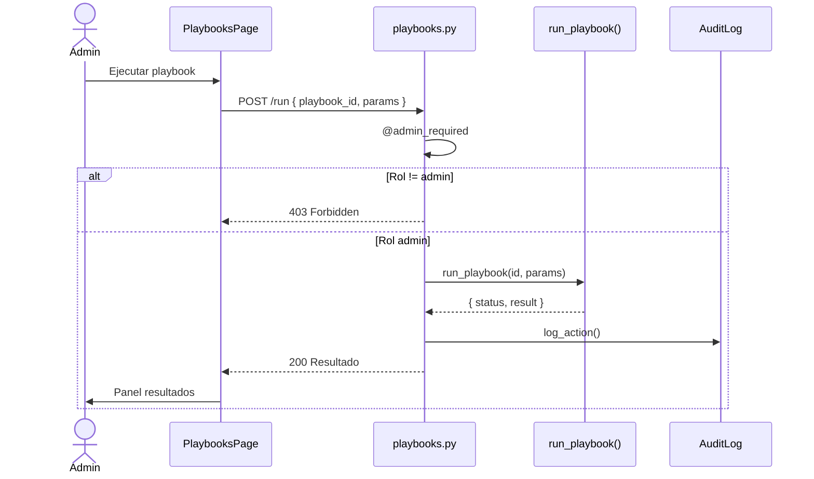

---

## 8. Diagrama de componentes

Arquitectura de componentes del sistema desacoplado.

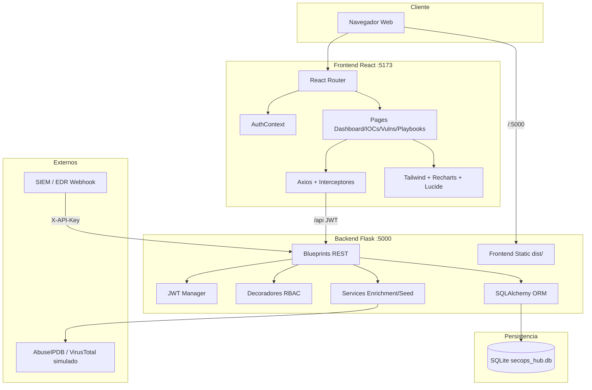

---

## 9. Diagrama de despliegue

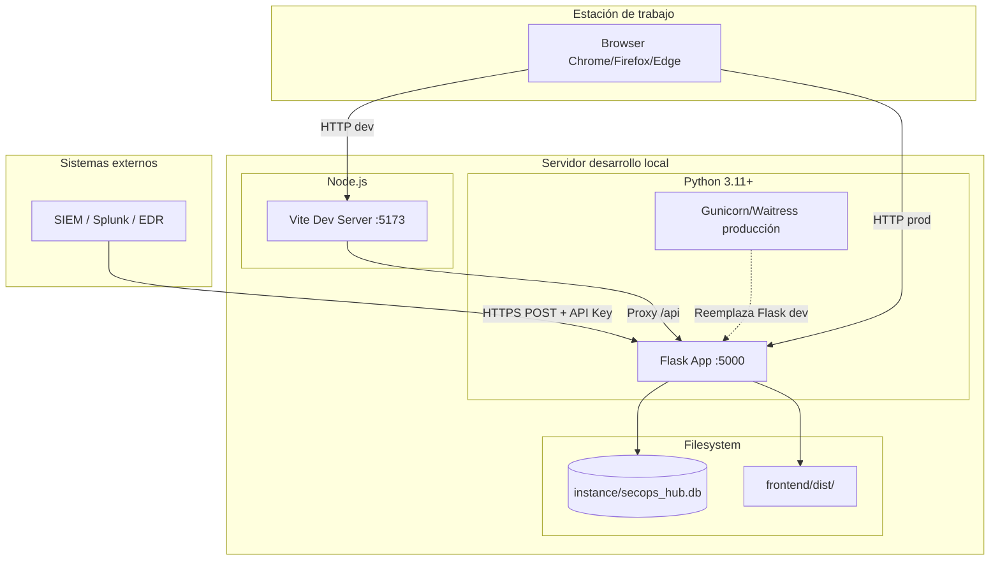

---

## 10. Diagrama de actividad — Flujo de triaje IOC

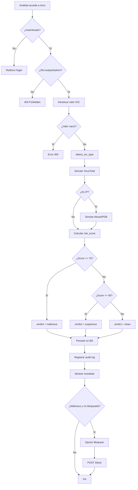

---

## 11. Diagrama de actividad — Autenticación y acceso

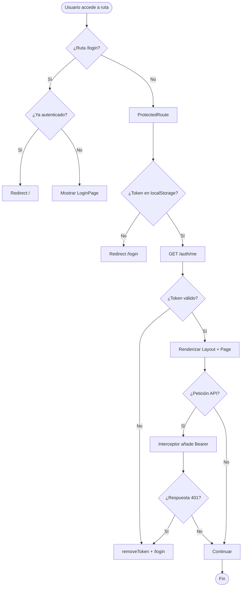

---

## 12. Diagrama entidad-relación (ERD)

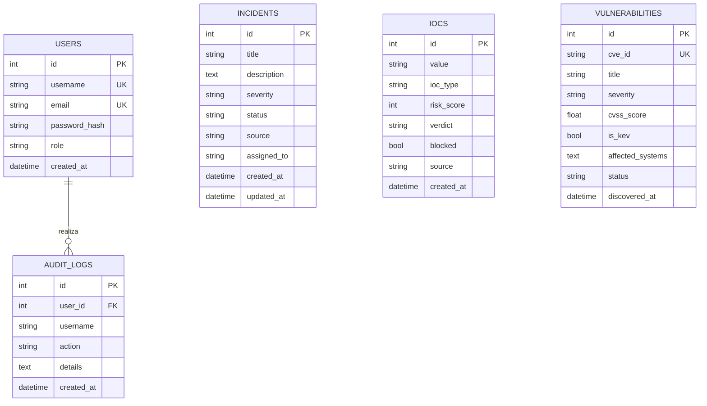

---

## 13. Diagrama de paquetes (backend)

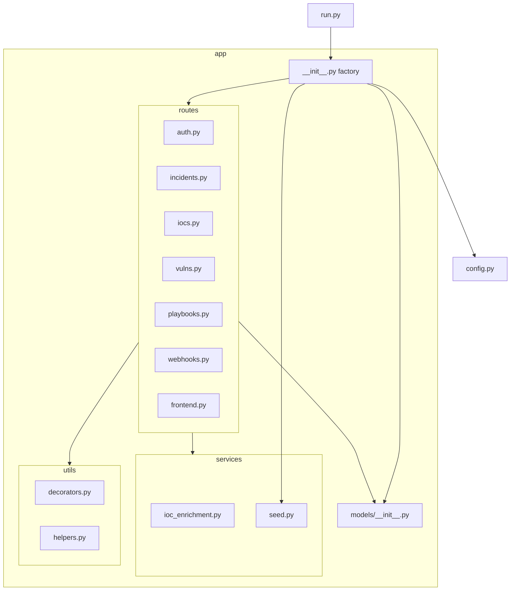

---

## 14. Diagrama de estados — Incidente

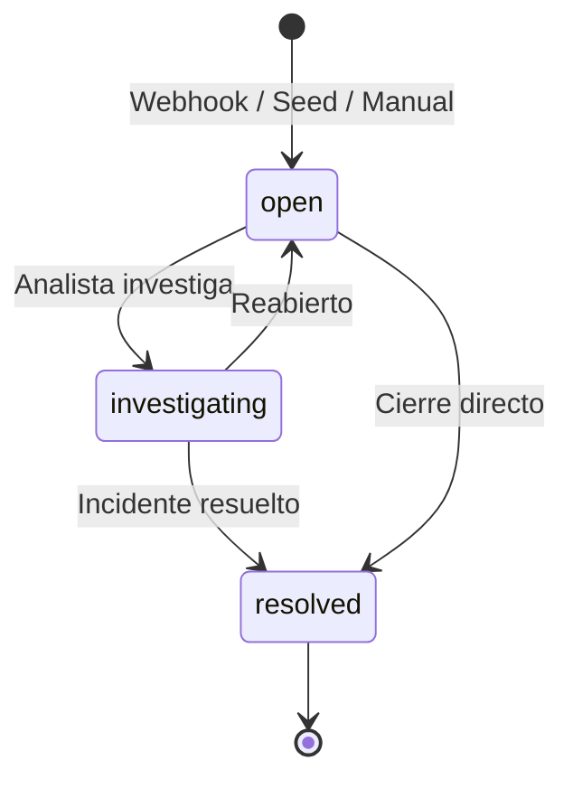

---

## 15. Diagrama de estados — IOC

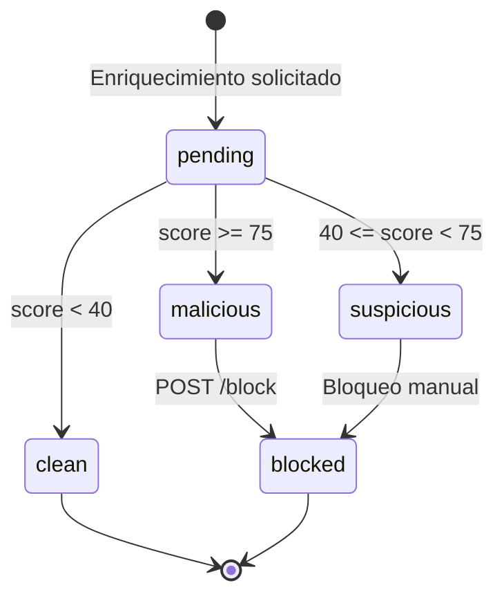

---

## 16. Referencia rápida de diagramas

| Diagrama | Uso principal | Sección |
|----------|---------------|---------|
| Casos de uso | Alcance funcional y actores | §1 |
| Clases dominio | Modelo de datos | §2 |
| Clases servicios | Lógica de negocio | §3 |
| Secuencia Login | Flujo autenticación | §4 |
| Secuencia IOC | Triaje de indicadores | §5 |
| Secuencia Webhook | Integración externa | §6 |
| Secuencia Playbook | Respuesta automatizada | §7 |
| Componentes | Arquitectura software | §8 |
| Despliegue | Infraestructura | §9 |
| Actividad IOC | Proceso operativo | §10 |
| Actividad Auth | Control de acceso | §11 |
| ERD | Base de datos | §12 |
| Paquetes | Organización código | §13 |
| Estados Incidente | Ciclo de vida | §14 |
| Estados IOC | Ciclo de vida | §15 |

---

## 17. Cómo visualizar

Los diagramas Mermaid se renderizan automáticamente en:

- GitHub / GitLab (vista previa Markdown)
- VS Code / Cursor con extensión Markdown Preview
- [Mermaid Live Editor](https://mermaid.live)

Para exportar a PNG/SVG, pegue el código en Mermaid Live Editor y use **Export**.
